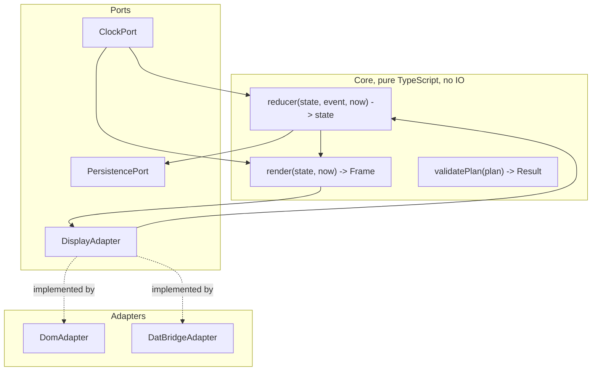
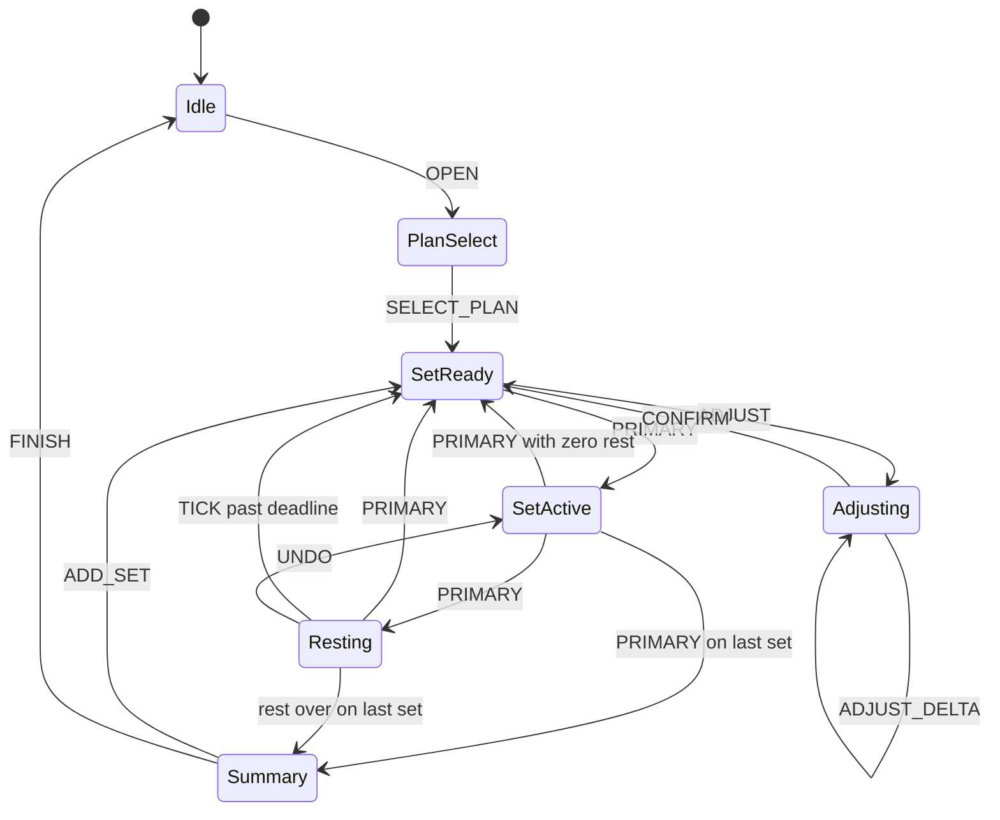

# 3. Architecture

## 3.1 Shape of the system



The core imports nothing from any runtime. No DOM, no `Date.now()`, no
`localStorage`. Time and storage arrive through ports. This is what makes the
edge cases in [section 4](04-edge-cases.md) plain table tests rather than flaky
integration tests.

There is no separate simulator adapter, because on this platform the browser
*is* the runtime. A Web App receives real arrow-key and Enter events, so
developing in Chrome at 600x600 with a keyboard exercises the same code path
that runs on the glasses. The differences are display physics and gesture
ergonomics, neither of which a simulator would have reproduced anyway.

## 3.2 Data model

Plans and logs are separate. A plan is authored content; a log is what happened.
Never mutate a plan to record progress.

```ts
type Unit = "kg" | "lb" | "bodyweight" | "time";

type Exercise = {
  id: string;
  name: string;                    // <= 18 chars, enforced by validatePlan
  unit: Unit;
};

type PlannedSet = {
  exerciseId: string;
  targetReps: number;
  targetWeightKg: number | null;   // canonical unit is always kg
  restSec: number;
};

type WorkoutPlan = {
  id: string;
  name: string;
  exercises: Record<string, Exercise>;
  sets: PlannedSet[];              // flat and ordered, see 3.3
};
```

```ts
type Phase =
  | "Idle"
  | "PlanSelect"
  | "SetReady"
  | "SetActive"
  | "Resting"
  | "Adjusting"
  | "Summary";

type AdjustState = {
  reps: number;                    // working copy, committed on CONFIRM
};

type LoggedSet = {
  planIndex: number;
  actualReps: number;
  actualWeightKg: number | null;
  completedAt: number;             // epoch ms
  restStartedAt: number | null;
  restEndedAt: number | null;
  restSkipped: boolean;
  adjusted: boolean;
};

type SessionState = {
  schemaVersion: 1;
  planId: string;
  startedAt: number;
  cursor: number;                  // index into plan.sets
  logged: LoggedSet[];
  phase: Phase;
  phaseEnteredAt: number;          // drives the idempotency window, see 4.1
  setStartedAt: number | null;
  restEndsAt: number | null;       // absolute deadline, see 3.4
  adjust: AdjustState | null;
  paused: boolean;
};
```

## 3.3 Why the set list is flat

The natural model is nested: a workout has exercises, each exercise has sets.
Flattening to one ordered `PlannedSet[]` removes a class of bugs outright.

- Progress is a single integer instead of a pair that can desynchronise.
- "Next set" is `cursor + 1`. There is no inner-loop / outer-loop boundary to
  get wrong at the last set of an exercise.
- Supersets and circuits need no special case; they are an interleaved ordering
  (`A1, B1, A2, B2`).
- Crash recovery restores one number.

Exercise grouping for display is derived by scanning the list, never stored.

## 3.4 Timers are absolute deadlines, never accumulated ticks

Every duration is stored as an absolute deadline and remaining time is computed
on read:

```ts
const remainingMs = Math.max(0, state.restEndsAt - now());
```

Never `remaining -= 1000` on a tick. Accumulation drifts whenever the runtime is
throttled and breaks outright when the app is backgrounded or the glasses come
off, which happens constantly in a gym.

With absolute deadlines, pause and resume need no handling at all. The clock
keeps running and the next render shows the truth. This is the same property
that makes the pure renderer work, and it is why there is no `Paused` phase in
the state machine.

## 3.5 Tick rate

For the Web Apps target, the countdown updates at 1 Hz. The app runs locally on
the glasses, so a per-second text update is a trivial DOM write.

This is worth stating explicitly because an earlier draft of this spec carried a
coarse/fine tick budget (5 s intervals dropping to 1 s in the final 15 s). That
was reasoned from DAT semantics, where every update is a **full-frame
replacement pushed over Bluetooth** and a 90-second rest would cost 90 sends.
Under Web Apps there is no such transport, and the optimisation buys nothing
while making the countdown feel broken. The budgeted policy belongs with the
`DatBridgeAdapter` if that path is ever built, not in the core.

The scheduler uses `setTimeout` aligned to the next whole second computed from
the deadline, so displayed digits never skip. `requestAnimationFrame` is not
used, since it is throttled or suspended when the app is not visible.

## 3.6 Phases and events



The set is logged and `cursor` advances on the `SetActive -> Resting`
transition, not when rest ends. So `Resting` already displays the *next* set as
its target, which is what makes the rest frame useful for planning the next
load.

Events are a closed union. The adapter translates platform input into exactly
these and nothing else:

```ts
type Event =
  | { t: "OPEN" }
  | { t: "SELECT_PLAN"; planId: string }
  | { t: "PRIMARY" }
  | { t: "ADJUST" }
  | { t: "ADJUST_DELTA"; delta: number }
  | { t: "CONFIRM" }
  | { t: "UNDO" }
  | { t: "ADD_SET" }
  | { t: "FINISH" }
  | { t: "TICK" }                  // scheduler wake, carries no user intent
  | { t: "VISIBILITY"; visible: boolean };
```

Two transitions are derived rather than dispatched. Rest ending is computed
inside the reducer on `TICK` when the deadline has passed, and the move to
`Summary` is computed after incrementing `cursor` past the last set. Neither is
an event an adapter can send, which keeps the "who is allowed to cause this"
question answerable by reading the union.

Skipping rest and rest expiring both land in `SetReady` with identical state, so
nothing downstream branches on which happened. The distinction is recorded in
`LoggedSet.restSkipped` for the log and nowhere else.

There is no `BACK` event, because the platform has no back gesture
([section 1.5](01-platform.md)). `UNDO` is dispatched by a visible focusable
element that exists only during `Resting`.

## 3.7 The display port

```ts
type Action = {
  id: string;                      // stable across renders, see 3.8
  label: string;                   // <= 12 chars
  event: Event;
};

type Frame = {
  heading?: string;
  hero?: string;
  meta?: string;
  actions: Action[];               // actions[0] is primary and default-focused
  effect?: "rest_over_pulse";
};

interface DisplayAdapter {
  commit(frame: Frame): void;
  onEvent(handler: (e: Event) => void): Unsubscribe;
}
```

`Frame` is deliberately shaped so the DAT component set (`FlexBox`, `Text`,
`Button`) maps onto it mechanically, should that path ever be needed.

## 3.8 Focus is view state, and re-rendering must not destroy it

This is the subtlety that separates a smooth app from a broken one on this
platform, and it is specific to Web Apps.

Focus lives in the DOM, not in `SessionState`. Arrow keys move it and never
touch application state. Only `Enter` dispatches an event. This keeps the
reducer free of UI concerns and means arrow-key spam cannot corrupt a workout.

The hazard: the countdown re-renders every second. A naive
`container.innerHTML = ...` would destroy and rebuild the focused button on
every tick, resetting focus to the top of the document once per second while the
user is trying to reach the undo button.

`commit()` therefore performs a keyed diff:

1. Text slots (`heading`, `hero`, `meta`) update via `textContent` on existing
   nodes when the slot is unchanged in structure.
2. Action buttons are matched by `Action.id`. An unchanged id keeps the existing
   DOM element, so focus survives.
3. Only genuinely new or removed actions touch the DOM tree.
4. After any structural change, focus is restored to the previously focused
   `Action.id` if it still exists, otherwise to `actions[0]`.

Action ids are stable and semantic (`primary`, `adjust`, `undo`), not derived
from labels or indices, precisely so that a label change from `Skip rest` to
`Start set` does not count as a new element.

Note the contrast with DAT, where the full-frame replacement means focus is the
platform's problem and this whole section is unnecessary. Same core, different
adapter responsibility.

## 3.9 Frames that need more than one value

Two frames do not fit the "one primary action" pattern cleanly, and both are
resolved the same way: by spending action slots rather than by giving arrow keys
meaning.

**Adjusting.** The user needs to change a number. The tempting design is to let
`ArrowLeft` and `ArrowRight` decrement and increment, but that would break the
rule that arrows only move focus, and would mean the same key does different
things in different phases. Instead the frame carries three actions,
`[minus, plus, done]`, dispatching `ADJUST_DELTA(-1)`, `ADJUST_DELTA(+1)` and
`CONFIRM`, with the working value in the hero slot.

Default focus is `minus`, not `done`. The overwhelmingly common adjustment is
reps below target after a missed set. This is also the one frame where the user
is expected to actually look at the display, since they entered a modal on
purpose, so the blind-select invariant is relaxed rather than violated.

There is no cancel. Adding a fourth 88 px action to a frame that already needs a
hero would not fit, and with no back gesture there is no free way to express it.
Since the only thing being edited is a rep count and the adjust flow is
reachable again from `SetReady`, correcting an over-adjustment costs the same
two selects that a cancel would have.

Adjust edits **reps only** in v1. Weight is planned in advance and rarely
deviates mid-set, whereas reps vary every time a set is missed. Adding a field
switcher would mean a fourth action, which does not fit.

**PlanSelect.** Each plan is a focusable action, and scrolling is unavailable.
At 88 px per element the frame holds four plans plus a `More` action that pages
to the next four. Plans are ordered most-recently-used first, so the common case
never needs the pager.

## 3.10 Persistence

`SessionState` is written to `localStorage` after **every phase transition**,
not on a timer. A transition is the only moment state meaningfully changes,
writes are small and well under the 5 MB budget, and this guarantees at most one
action can ever be lost.

This matters more than usual because Web Apps have no offline support. A reload
requires the network, and if it succeeds the app must come back to the same set
rather than an empty session.

Completed workouts append to a local history log. Cloud sync, if ever added, is
strictly out-of-band and must never sit in the interaction path.
